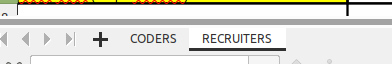
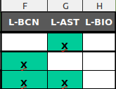
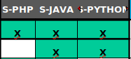
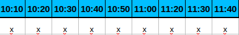

**Instrucciones:**

-Para el procesamiento es necesario introducirle un documento en excel con dos hojas de cálculo:

una de CODERS y otra de RECRUITERS.

**Recruiters:**

-Columnas necesarias para que el programa funcione correctamente: 

EMPRESA, 

NOMBRE DEL RECRUITER

-Ubicaciones: en formato L-BIO, L-AST, si se requiere introducir ubicación nueva es necesario

que la ubicación sea escrita con prefijo L- y seleccionar las ubicaciones correspondientes con una X o x.

-Skills: en formato S-JAVA, S-PYTHON, si se requiere introducir una skill nueva es necesario

que la skill sea escrita con prefijo S- y seleccionar los skills correspondientes con una X o x

-Horarios: 10:10, 10:20, en el caso de los caso de los descansos generales no introducir esa columna,es necesario omitirla. En el caso de que un recruiter no se encuentre disponible a esa hora dejar vacío.

**Coders:**

-Columna necesaria: NOMBRE Y APELLIDOS y  seleccionar ubicaciones.

-Ubicaciones: en formato L-BIO, L-AST, si se requiere introducir ubicación nueva es necesario que la ubicación sea escrita con prefijo L- y seleccionar las ubicaciones correspondientes con una X o x.

	

-Skills: en formato S-JAVA, S-PYTHON, si se requiere introducir una skill nueva es necesario que la skill sea escrita con prefijo S- y seleccionar los skills correspondientes con una X o x.

**NOTA EXTRA**

El programa puede ser utilizado de dos modos distintos:

#1-Haciendo uso de filtrado de ubicaciones y skills, por lo cual es necesario en las hojas de cálculo (RECRUITERS Y CODERS) tener las columnas skills introducidas de acuerdo a los criterios explicados anteriormente. -Genera un resultado mas filtrado, por lo tanto genera mas espacios vacíos al no encontrar el match adecuado entre lo que los recruiters buscan y los conocimientos de los estudiantes.

#2-Haciendo uso solo de filtrado por ubicación-Genera un mejor rellenado de la matriz.

Para generar este resultado es necesario borrar en ambas hojas de cálculo (RECRUITERS Y CODERS) las skills (es decir, las columnas que comienzan por S-) de modo que el programa generará un filtrado solo por ubicación.

**NOTA FINAL**

El resultado final que genera este programa variará cada vez que se ejecuta. Es importante tener esto en consideración por si obtenemos el resultado que se adecúa a las necesidades y guardarlo.

-Se incluye a modo de prueba hojas de cálculo con el formato adecuado para que puedan ser procesadas por la aplicación dentro de  la carpeta read Excel-formato.
